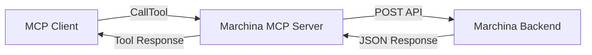

# Marchina MCP Server

A Model Context Protocol (MCP) server plugin for **Marchina**, enabling guest users (e.g., via Cursor or Claude Desktop) to create projects seamlessly.


Quick Links to Marchina Repositories
- [Marchina Frontend](https://github.com/Paul-M-Kallarackal/marchina-frontend)
- [Marchina Backend](https://github.com/Paul-M-Kallarackal/marchina-backend)


## Features

- Exposes a `create_project` tool to MCP clients
- Proxies project creation requests to the Marchina backend `/mcp/guest/project` endpoint
- Returns JSON results or error messages
- Zero-configuration setup using `npx @marchina/npx-mcp`

## Table of Contents

- [Configuration](#configuration)
- [Usage](#usage)
- [Tool Schema](#tool-schema)
- [How It Works](#how-it-works)
- [Example Interaction](#example-interaction)


## Configuration

Create or update your `mcp.json` to include Marchina:

```json
{
  "mcpServers": {
    "marchina": {
      "command": "npx",
      "args": ["-y", "@marchina/npx-mcp"],
      "env": {
      }
    }
  }
}
```


## Usage

MCP clients (Cursor, Claude Desktop) will auto-discover the `create_project` tool. Invoke it with:

- `name`: string — The project name
- `description`: string — The project description

The MCP server forwards the request to the Marchina backend and returns the created project details.

## Tool Schema

```json
{
  "name": "create_project",
  "description": "Creates a new project with the specified name and description",
  "inputSchema": {
    "type": "object",
    "properties": {
      "name": { "type": "string", "description": "Name of the project" },
      "description": { "type": "string", "description": "Description of the project" }
    },
    "required": ["name", "description"]
  }
}
```

## How It Works



## Example Interaction

> **User**: `create_project` { name: "My E-commerce App", description: "An online store for crafts" }

> **Server Response**:
```json
{
  "id": 123,
  "name": "My E-commerce App",
  "description": "An online store for crafts",
  "createdAt": "2024-07-01T12:34:56.789Z"
}
```

